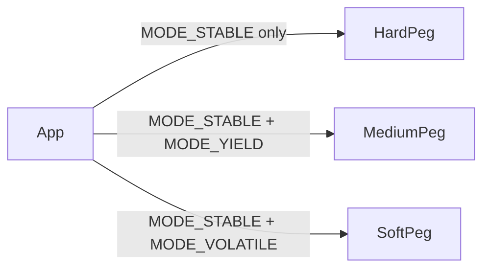
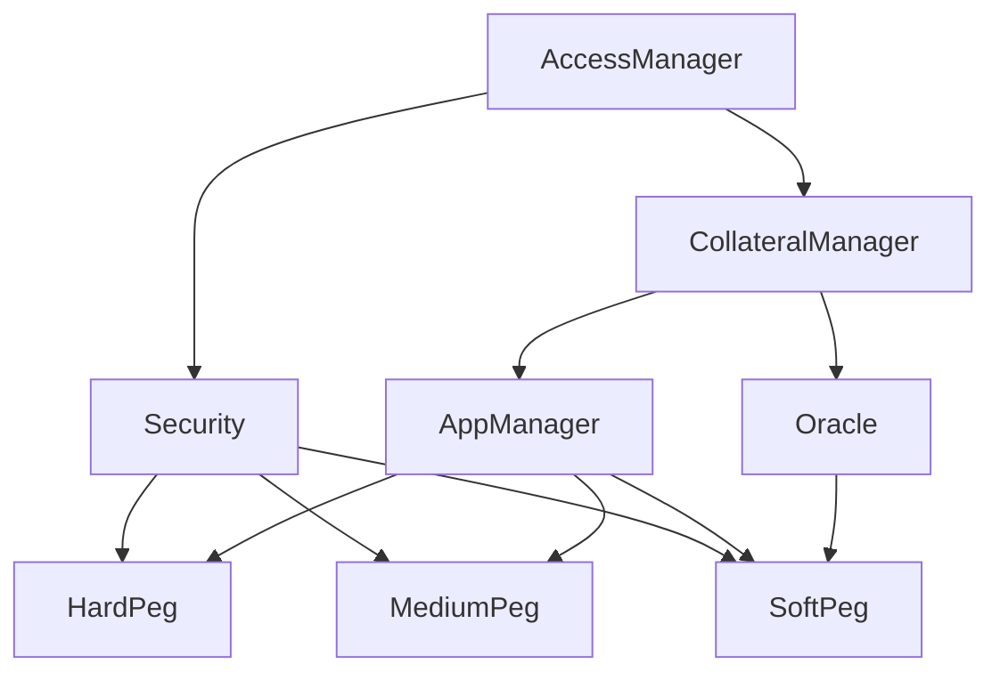
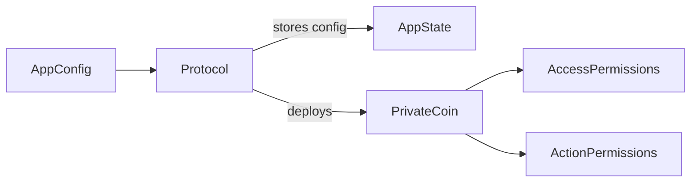

# ARC Protocol

A multi-peg stablecoin infrastructure for permissioned, app-scoped stablecoins with configurable collateral risk tiers.

  

---

## Overview

ARC Protocol is a singleton stablecoin engine that allows third-party apps to deploy isolated, permissioned ERC-20 stablecoins without owning or managing risk infrastructure. Each app registers a configuration against a shared peg module — which handles oracle pricing, collateral accounting, health checks, and liquidations.

The protocol routes apps to one of three peg designs based on the collateral types they intend to support. This separation is intentional: it groups apps by risk profile while keeping the risk engine centralized and auditable.

Apps do not deploy their own risk contracts. Instead, they deploy a lightweight `PrivateCoin` ERC-20 with app-specific access control, while the shared peg module enforces all economic invariants.

---

## Key Features

- Three isolated peg modules (Hard / Medium / Soft) with collateral-type-gated instantiation
- Per-app `PrivateCoin` ERC-20 with bitmask-enforced mint, hold, and transfer permissions
- ERC-20 Permit support on all app tokens for gasless flows and account abstraction
- Share-based collateral and debt accounting to handle multi-token pools without oracle dependency (HardPeg)
- Chainlink oracle integration with staleness, round completeness, and negative-price guards (SoftPeg)
- Per-function timelock with configurable delay and grace period windows
- Two-phase deployment: owner-controlled setup phase transitions to timelock-only governance
- Role bitmask system — a single `uint256` encodes multi-role membership per address
- Invariant and agent-based fuzz test suite with conservation and solvency assertions

---

## Tech Stack

| Category | Technology |
|---|---|
| Language | Solidity ^0.8.13 |
| Build & Test | Foundry (Forge, Anvil, Cast) |
| Token Standards | ERC-20, ERC-20 Permit, ERC-4626 |
| Access Control | Custom bitmask roles (no OZ AccessControl) |
| Oracle | Chainlink AggregatorV3 |
| Math | OpenZeppelin `Math.mulDiv` (overflow-safe) |
| Dependencies | OpenZeppelin v5.5.0, forge-std v1.14.0 |

---

## Protocol Architecture

### Peg Selection by Collateral Type

App instances are routed to a peg module at registration time based on the collateral types they configure. The peg type is immutable per deployment.



### Shared Contract Inheritance

All three peg modules inherit from the same shared abstract layer. Core risk logic lives in the peg-specific contract; everything else is shared.



### App Instance Lifecycle



---

## Peg Designs

### HardPeg
Accepts only `MODE_STABLE` collateral. Mints at a 1:1 value ratio against deposited collateral. No oracles, no liquidations. Redemption returns a pro-rata basket of all collateral types held by the protocol. Internal accounting uses a `value unit` abstraction, normalizing all token amounts by their decimal scale.

### MediumPeg
Accepts `MODE_STABLE + MODE_YIELD` collateral (ERC-4626 vaults). Deposits store both the share count and the principal value at deposit time. Minting is capped to the fixed principal, not the current vault value — preventing debt inflation as yield accrues. Yield above principal is claimable by the depositor on withdrawal.

### SoftPeg
Accepts `MODE_STABLE + MODE_VOLATILE` collateral with Chainlink price feeds. Implements full CDP mechanics: share-based collateral vaults, debt share accounting, health factor calculation, and partial liquidations with tiered close factors based on position health.

---

## Core Subsystems

### AccessManager
Roles stored as bit flags in a single `uint256`. Multi-role membership costs one mapping slot. The `onlyTimeLock` modifier is phase-sensitive: before `finishSetUp()` it allows the owner; after, it only allows the timelock contract. This enables a clean deployment phase without timelock latency.

### CollateralManager
Global collateral registry. Each token is assigned a non-zero sequential ID used for bitmask lookups downstream. Collateral modes are bitmask constants (`MODE_STABLE`, `MODE_VOLATILE`, `MODE_YIELD`, `MODE_ACTIVE`). The allowed mode set is immutable per peg deployment, enforced via a constructor-time `immutable` bitmask.

### AppManager
Factory for app instances. On `newInstance()`, a `PrivateCoin` is deployed and the app's allowed collateral set is computed as a bitmask of collateral IDs. Collateral eligibility is checked in O(1) by testing a bit against `tokensAllowed`. Enforces that at least one valid collateral is set before registration completes.

### PrivateCoin
Non-standard ERC-20. Intentional deviations from the standard:
- `mint` and `burn` restricted to the protocol engine address
- `transfer` and `transferFrom` enforce destination permission checks
- Allowances are bypassed in the engine's burn/transfer flows; standard approvals and ERC-20 Permit remain available for user-initiated flows
- Liquidator role bypasses `from`/`to` permission checks at mint time (self-mint only) but cannot transfer tokens externally

### Oracle
Wraps Chainlink `AggregatorV3`. Validates: positive price, freshness within `STALENESS_THRESHOLD` (24h), and round completeness (`answeredInRound >= roundId`). Exposes a non-reverting `getPriceWithStatus()` for off-chain monitoring.

### Security
Protocol-level circuit breakers. Uses EVM transient storage (`TSTORE`/`TLOAD`, EIP-1153) to track per-transaction mint volume, enforcing `mintCapPerTx` without persistent state. Pausing is instantaneous by the governor; unpausing is timelock-delayed. Global debt cap enforced at mint time.

### Timelock
Function-level timelock with per-selector configuration. Each sensitive function selector maps to a role requirement, delay, and grace period. Queue, cancel, and execute are separate transactions. The owner can cancel any queued transaction as an emergency override.

---

## Collateral & Debt Accounting (SoftPeg)

Both collateral and debt use a share/asset model (analogous to ERC-4626) to correctly handle pool growth and rounding.

```
newShare = (assetChange × totalShares) / totalAssets   // first deposit: 1:1
assets   = (shares × totalAssets) / totalShares
```

Health factor uses `liquidityThreshold` (distinct from LTV) to determine the maximum debt a position can sustain:

```
HF = (Σ collateralValue_i × liquidityThreshold_i) / totalDebt
```

Liquidation triggers when `HF < 1.0 WAD`. Close factor is tiered by health severity:

| HF Range | Max Closeable |
|---|---|
| < 0.75 | 100% |
| 0.75 – 0.90 | 50% |
| ≥ 0.90 | 25% |

---

## Key Design Decisions

**Singleton peg per collateral tier, not per app.** A shared risk engine concentrates oracle validation, debt accounting, and liquidation logic in one auditable contract. Apps inherit security guarantees without deploying independent risk contracts.

**PrivateCoin per app rather than shared balances.** Storage for per-app user permission sets is large and app-specific. Offloading it to per-app contracts avoids storage bloat in the core protocol. Merkle proofs were considered but rejected: they increase gas cost per token operation and degrade UX.

**Bitmask roles and collateral permissions.** A single `uint256` encodes full role membership and token permission sets. Collateral eligibility for an app is a single bitwise `&` against the protocol's registered collateral IDs — O(1) regardless of registry size.

**Two-phase deployment (`isSetUp` flag).** Allows the deployer to register collateral and configure protocol parameters atomically without timelock delays, then transfer ownership and lock governance. Eliminates the bootstrapping attack surface where protocol state is partially configured.

**Transient storage for per-tx mint cap.** `TSTORE`/`TLOAD` tracks cumulative mints within a single transaction without writing to persistent storage. This prevents multi-call batch minting abuse at zero net gas cost for the happy path.

**Adapters over a unified interface.** Each peg module exposes slightly different function signatures (e.g., `HardPeg.withdrawCollateral` takes a value amount; `SoftPeg.withdrawCollateral` takes a token and value). Adapter contracts implement the common `IStablePeg` interface for frontend consumers, absorbing the differences cleanly.

---

## Project Structure

```
src/
  core/
    HardPeg.sol            # Stable-only 1:1 peg, no oracles
    MediumPeg.sol          # ERC-4626 yield collateral peg
    SoftPeg.sol            # Volatile collateral peg with liquidations
    shared/
      AccessManager.sol    # Bitmask roles, setup phase, ownership transfer
      CollateralManager.sol# Global collateral registry and config
      AppManager.sol       # App instance factory, PrivateCoin deployment
      Oracle.sol           # Chainlink wrapper with safety validation
      Security.sol         # Pause controls, global debt cap, tx mint cap
  adapters/
    IStablePeg.sol         # Unified frontend interface
    HardPegAdapter.sol
    MediumPegAdapter.sol
    SoftPegAdapter.sol
  PrivateCoin.sol          # App-scoped permissioned ERC-20 + Permit
  Timelock.sol             # Per-selector function-level timelock
  utils/
    ActionsLib.sol         # Permission bitmask constants and invariant checks
    CollateralLib.sol      # Collateral mode flags and peg routing
    RiskMathLib.sol        # Share math, health factor, safe mulDiv
    RolesLib.sol           # Protocol role constants
    ErrorLib.sol           # Centralised custom errors

test/
  unit/                    # Isolated contract tests via harnesses
  invariant/               # Agent-based fuzz with conservation/solvency assertions
  mocks/                   # MockAggregator, MockRandomOracle, MockToken
  utils/                   # BaseEconomicTest, CoreLib helpers, IPeg interface

script/
  deploy/                  # Chain-aware deployment scripts per peg type
```

---

## Getting Started

### Requirements

- [Foundry](https://getfoundry.sh/)
- `.env` with `PRIVATE_KEY` and `OWNER`

### Build

```shell
forge build
```

### Test

```shell
forge test
forge test --match-contract HardPegFuzz   # invariant suite only
forge snapshot                             # gas benchmarks
```

### Deploy

```shell
# Local
forge script script/deploy/DeployHardPeg.s.sol

# Testnet (simulate, no broadcast)
forge script script/deploy/DeployHardPeg.s.sol --rpc-url $RPC_SEPOLIA

# Testnet (deploy + verify)
forge script script/deploy/DeployHardPeg.s.sol --rpc-url $RPC_SEPOLIA --broadcast --verify
```

ABI is written to `./out/HardPeg.sol/HardPeg.json` on every build.

Deployed on Sepolia: [`0x3fe8A3760C2794A05e7e8EFBF41Ec831A0eb74F9`](https://sepolia.etherscan.io/address/0x3fe8a3760c2794a05e7e8efbf41ec831a0eb74f9#code)

---

## Security Considerations

**Reentrancy.** All state mutations (vault balances, debt shares, pool totals) complete before external token transfers. `SafeERC20` wraps all ERC-20 interactions.

**Oracle manipulation.** `SoftPeg` enforces staleness (24h), round completeness, and price positivity. Single feed per collateral — no fallback oracle is currently implemented (listed as a future improvement).

**Access control.** `onlyTimeLock` is phase-sensitive and cannot be bypassed post-setup. `finishSetUp()` transitions state permanently; the deployer holds no special privilege after ownership transfer.

**Liquidation dust.** `liquidate()` reverts if the computed output share rounds to zero (`LiquidationDust`), preventing griefing via dust amounts that modify state without economic effect.

**Permit surface.** ERC-20 Permit enables gasless approvals but `transferFrom` still enforces destination permission checks regardless of how the allowance was granted.

**Liquidator role isolation.** Liquidators can self-mint app tokens during a liquidation but cannot hold, receive, or transfer them in any other context — enforced in `PrivateCoin` independently of the engine.

---

## Testing Infrastructure

| Suite | Description |
|---|---|
| Unit | All shared modules, all three pegs, PrivateCoin, Timelock |
| Fuzz (property) | `RiskMathLib`, oracle price validity |
| Invariant / Agent | Conservation (`Σcollateral == pool`), solvency (`pool ≥ supply`), typed agent simulations |

Fuzz agent types: `RETAIL`, `ARB`, `WHALE`, `GRIEFER` — each with a distinct behavioral distribution across deposit/mint/redeem/transfer. Oracle prices evolve probabilistically per simulation tick using a seeded random walk.

---

## Future Improvements

- Oracle fallback: secondary feed if primary is stale or invalid
- Cross-chain `PrivateCoin` via LayerZero / Li.Fi
- Scenario attack scripts: oracle flash manipulation, sandwich deposit/withdraw, precision drain over many rounds
- Batch liquidation endpoint for liquidator bots
- Full deployment and test parity for `MediumPeg` and `SoftPeg`
- Formal verification of share-math invariants

---

## License

UNLICENSED